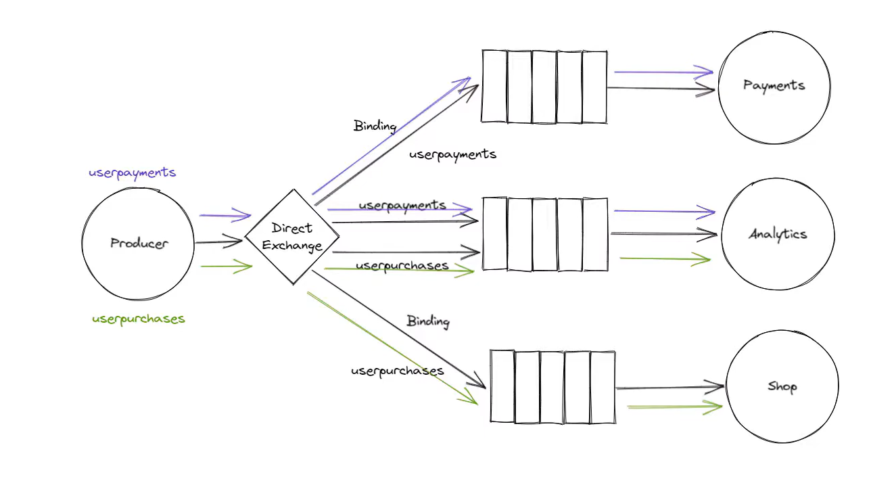
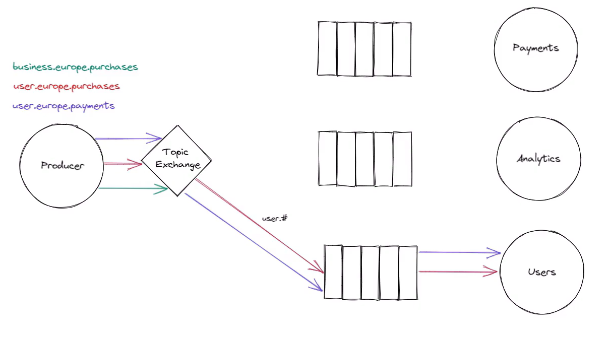

# RabbitMq Getting Started Notes

Go to this specific branch to see the examples:

- [Competing Consumer](https://github.com/habiburrahman-mu/rabbitmq-getting-started/tree/competing-consumer)
- [Pub Sub](https://github.com/habiburrahman-mu/rabbitmq-getting-started/tree/pub-sub)
- [Routing](https://github.com/habiburrahman-mu/rabbitmq-getting-started/tree/routing)
- [Request Reply](https://github.com/habiburrahman-mu/rabbitmq-getting-started/tree/request-reply)

## Declaration
The materials in this repository, including notes and code, are compiled from a variety of reputable internet sources.

## Some common terminologies

- Publisher
- Consumer
- Exchange
- Channels
- Connection

RabbitMq uses these protocols

- AMQP 0-9-1
- AMQP 1-0
- MQTT
- STOMP

    These are actually the application layer protocols


TLS is a presentation layer protocol.

### AMQP Model

It expects that message broker has some certain components

1. Exchange: Message will send to the exchange. Exchange is responsible for routing the messages to the queues.
2. Queues: Consumer will listen to these queues.

### AMQP Frames

1. Method Frame
2. Content Header Frame
3. Body Frame
4. Heartbeat Frame

Frame Type | Channel | Size | Frame Specific Content | Frame End

AMQP Specification

### TCP 3 way handshake

- TCP connection socket
- SYN → SYN/ACK → ACK

In order to make a connection with RabbitMQ, first tcp 3-way handshake will happen, which only has info till Transport Layer from bottom(Physical Layer). RabbitMQ server then send anther packet which has info till Application Layer(that means this packet also has TCP info).Then publisher send the ACK to satisfy TCP protocol with some more info at Application Layer(although ACK can even be sent with info till Transport layer itself).

***Why RabbitMQ is highly reliable? TCP is highly reliable?***

## Channel

You can create multiple channel on single connection. 

Connection can be multiplexed.

While creating channels it involves 2 TCP packets.

## Exchange

Brains behind RabbitMQ. It can be of various types.

- **Direct**:
    - Bind a queue to the exchange. While publishing message → requires the routing/ binding key.
- **Default Exchange**:
    - It will create a queue automatically and queue name will be same as the routing key.
    - Binding: Routing key = queue name
- **Topic:**
    - Message sent to a topic can’t have an arbitrary routing key - it must be a list of words
    - * (star) can substitute for exactly one word
    - \# (hash) can substitute for zero or more words
    - [https://www.rabbitmq.com/tutorials/tutorial-five-dotnet.html](https://www.rabbitmq.com/tutorials/tutorial-five-dotnet.html)
- **Fanout Exchange:**
    - Routes messages to all the queues that are bound to it. It is like broadcasting the messages.
    - In this type of exchange, the routing key is not important. A message sent to a fanout exchange will go to all queues that are bound to it, irrespective of routing keys.
- **Headers Exchange:**
    - Messages are routed based on arguments containing headers and optional values.
    - Headers exchanges ignore the routing key attribute.
    - A message is considered matching if the value of the header equals the value specified upon binding.
- **Dead Letter Exchange:**
    - When a message can't be routed, is rejected, or expires, it can be sent to a DLX.
    - This is an exchange where these 'failed' messages are sent, providing a way to handle them differently from the normally processed messages.
- **Alternate Exchange:**
    - If a message can't be routed to any queue (i.e., if there are no queues bound to the exchange, or none match the routing key), it can be sent to an AE.
    - This provides a safety net for messages that can't be routed properly.

### Routing Key

The routing key is a message attribute. The exchange might look at this key when deciding how to route the message to queues (depending on exchange type). The routing key is like an address for the message.

### Binding

The relationship between a exchange and a queue is Binding.

## Publish

→ Requires one tcp packet and acknowledgement.

## How are the messages forwarded to the consumer?

- Messages are forwarded to the consumer from the queue they are listening to.
- When the consumer is ready to process a message, it sends an acknowledgement to the broker.
- After receiving the acknowledgement, the broker removes the message from the queue.
- If the broker does not receive an acknowledgement, due to a consumer crash for example, it will re-queue the message and attempt to deliver it to another consumer.

RabbitMQ handles multiple consumers for a single queue by distributing messages in a round-robin manner. This means that each message from the queue is delivered to the next consumer in turn, and every consumer gets the same number of messages. If some consumers are slower than others, RabbitMQ won't dispatch messages to them until they have finished processing and acknowledged their previous messages.

## Acknowledgement

- **Auto Acknowledgement**
    - This means that a message is considered to be successfully delivered immediately after it is sent.
    - This does not guarantee that the message has been successfully received or processed by the consumer.
    - It only guarantees that the broker successfully sent it.
    - If the consumer crashes during processing, the message will be lost.
- **Manual Acknowledgement**
    - With manual acknowledgements, the consumer sends an acknowledgement back to the broker after it has finished processing the message, to indicate that the message has been successfully processed and can be deleted from the queue.
    - If the consumer crashes before sending the acknowledgement, RabbitMQ will understand that a message wasn't processed fully and will re-queue it.
    - If another consumer is available, it will then quickly redeliver the message to another consumer. That way you can be sure that no message is lost, even if the workers occasionally die.
    - There aren't any message timeouts; RabbitMQ will redeliver the message only when the consumer connection dies. It's fine even if processing a message takes a very, very long time.
    - We have to maintain the data idempotency and consistency while using manual acknowledgement.

**Reject Acknowledgement**

Reject acknowledgement is another feature provided by RabbitMQ, which is often used when a consumer cannot process a message. When the consumer sends a reject acknowledgement to the broker, the broker can either discard the message or re-queue it.

If the message is re-queued, it can be delivered to the same consumer or a different one. However, if the message is continuously re-queued, it can lead to a situation where the same message is repeatedly delivered but never processed, which can cause a lot of unnecessary network traffic and CPU load. Therefore, it's crucial to handle such situations carefully.

To avoid such problems, RabbitMQ provides a feature called "***Dead Letter Exchanges***". When a message is rejected, it's sent to a Dead Letter Exchange, where it can be inspected and handled separately. This is a better approach than simply discarding the message or continuously re-queuing it.

## Handle RabbitMQ server crash or connection lost!

### Durable Queues

Durable queues are queues that survive broker restarts. 

While all the above-discussed contents of a queue (messages, consumers, etc.) are always held in memory, for durable queues, RabbitMQ uses a write-ahead log to persist parts of its state to disk. 

This allows it to recover state and messages in the face of failures. 

When a message is published to a durable queue, it's written to disk. 

It's worth noting that message persistence doesn't fully guarantee that a message won't be lost; although it's a strong guarantee, messages can still be lost in the event of a crash while the message is in transit. 

To ensure that messages aren't lost, both the queue and the message must be marked as durable.

### Persistent Message

A persistent message is a message that is stored to disk as soon as it enters the queue. 

It remains stored until it's consumed or until the queue is purged. 

By marking messages as persistent, we can ensure that they won't be lost even in the event of a broker restart or system crash.

## Bulk Acknowledgement

Bulk acknowledgement allows a consumer to acknowledge multiple messages at once, reducing network traffic and CPU load when managing many messages.

In RabbitMQ, unacknowledged messages, those being processed but not yet acknowledged, are not available to other consumers. This is beneficial for time-consuming tasks, preventing other consumers from receiving the message until processing is complete.

Consumers can opt for a single acknowledgement after processing a batch of messages, known as bulk acknowledgement.

In case of a failure or lost connection, only acknowledged messages are removed from the queue. Unacknowledged messages are requeued and redelivered. Thus, if using bulk acknowledgement, consumers must manage potential failures and ensure all batch messages can be safely reprocessed before acknowledgement.

## Prefetch Count and Size

The prefetch count configuration controls how many messages are sent to the consumer at a time. If the prefetch count is set to 1, RabbitMQ will send one message at a time to the consumer. The consumer will then acknowledge the message after it's processed, and only then will RabbitMQ send the next message.

Setting a prefetch count helps in managing memory and improving the message throughput. For instance, if you have a heavy processing task, you might want to limit the prefetch count to prevent the consumer from being overwhelmed with messages.

On the other hand, the prefetch size configuration controls the total size of the unacknowledged messages that RabbitMQ will allow on the consumer side. This is less commonly used as compared to prefetch count but can be useful in situations where message size is a concern.

Both these settings can be configured according to the specific requirement of your application and the processing power of your consumer.

## Publisher confirms

- Publisher confirms are a RabbitMQ extension to the AMQP 0.9.1 protocol.
- They allow publishers to know when a message has been successfully handled by the broker.
- To use publisher confirms, a client first confirms a channel with the *confirm.select* method.
- Once a channel is in confirm mode, both the broker and the client count messages (counting starts at one on the first *confirm.select*).
- For every message that the publisher sends, the broker responds with a *basic.ack*, which includes the sequence number of the message.
- The broker may also respond with a *basic.nack* if it couldn't process the message successfully.
- If multiple messages were confirmed or *nacked* at once, the broker will include the multiple field set to true, and the sequence number will be the highest sequence number among these messages.

## Notes

[https://shiny-mars-3e0.notion.site/RabbitMQ-890145ac0a0f414894e1e6eebee46b47](https://www.notion.so/RabbitMQ-890145ac0a0f414894e1e6eebee46b47?pvs=21)

---

## Competing Consumers Pattern

The Competing Consumers design pattern in RabbitMQ allows multiple consumers to process messages from one queue simultaneously, distributing the load for parallel processing and improved speed. In this setup, RabbitMQ uses round-robin scheduling, ensuring each consumer processes a unique message. If a consumer fails, acknowledgements and negative acknowledgements permit the message to return to the queue for processing by others. This pattern boosts throughput and parallel processing in RabbitMQ.

### RabbitMQ Prefetch Count

The RabbitMQ prefetch value is used to specify how many messages are being sent at the same time.

```csharp
channel.BasicQos(prefetchSize: 0, prefetchCount: 1, global: false);
```

## Pub-Sub Design Pattern

- Send message to multiple consumers
- We can use fanout exchange for this purpose
- bind queues to this fanout exchange
- all queues of fanout exchange will get these messages
- Producer does not need to define or know about the queues, it will interact with the exchange
    
    ```csharp
    channel.ExchangeDeclare(exchange: "pubsub", type: ExchangeType.Fanout);
    
    // consumer
    var queueName = channel.QueueDeclare().QueueName;
    var consumer = new EventingBasicConsumer(channel);
    channel.QueueBind(queueName, exchange: "pubsub", routingKey: "");
    ```

## Routing

**Direct Exchange:**

- Multiple queues can be bound to the single direct exchange using the same binding keys.
- Single queue can also have multiple bindings.



analytics has multiple bindings.
**Topic Exchange:**

- Real power of the topic exchange coming from using the special wildcard characters that are supported when adding binding keys.
  - we can use start (*) character to substitute for exactly one word
  - we can use hash (#) character to substitute for zero or more words


- **Star (*) wildcard:**
  - `user.europe.*` *binding key* means queue wants to receive any message that begins with `user.europe` and then ends in one word.
  - `*.europe.purchases` this means queue wants to receive any message with start of word and ends with `eurpoe.purchaes` .
  - `*.europe.*` any message with middle in `europe`.



- **Hash Wildcard (#):**
  - queues with binding key `user.#` receives messages that begins with `user` and it doesn’t matter what else comes after it. Anything up to the maximum of 255 bytes.

## Request-Reply Pattern


- Client will first declare a queue that it wants to receive response for this request.
- Client sends request to the exchange, then the message is put into a queue.
- The server then receives the message from the request queue and process the message
- Then it sends the reply to the default exchange / other exchange to route it through the reply queue.
- Then the client receives it from the reply queue.
- `reply_to` = Reply Queue name to indicate the queue to which server will send the response.
- to uniquely identify the message the meta data with requests are send.
- the metadata used usually are `message_id` and `correlation_id`.

## Exchange to Exchange Routing


- The exchange to exchange binding is useful when messages need to be saved for queues that are automatically deleted, or when load balancing topics within a single broker.
- When sending the same messages to different exchange types, exchange to exchange binding is the best way forward.

## Header Exchange

- uses arguments with headers and optional values to route messages.
- Identical to topic exchange, but here routing are based on header values rather than routing keys.
- `x-match` indicates whether all headers must match or only one.
- The `x-match` property has two possible values: `any` and `all`, with `all` being the default.
- A value of `all` indicates that all header pairs (key, value) must match.
- `any` indicates that at least one pair must match.
- Instead of a string, headers can be built with a larger range of data types, such as integers or hashes.
- For the header RabbitMQ exchange type, `amq.headers` is the default topic exchange that AMQP brokers must supply.


```csharp
// Publisher
var properties = channel.CreateBasicProperties();
properties.Headers = new Dictionary<string, object>
{
    {"name", "test"}
};
channel.BasicPublish(exchange: "headersExchange", routingKey: "", properties, body: body);

// Consumer
var bindingArguments = new Dictionary<string, object>
{
    {"x-match", "any"},
    {"name", "test"},
    {"age", "21"},
};
channel.QueueBind("letterbox", "headersExchange", "", bindingArguments);
```

## Consistent Hashing Exchange

- Have to enable this exchange manually
- The mail goal is to distribute the messages possibly equally come to this exchange to the queues connected to this exchange.
- RabbitMQ Consistent Hash Exchange Type Plugin.

    ```bash
    rabbitmq-plugins enable rabbitmq_consistent_hash_exchange
    ```
- After Enabling Consistent Hash Exchange Type Below Exchange option will be Available to Use.

    

*Note:* https://tutexchange.com/what-is-consistent-hashing-exchange-in-rabbitmq/